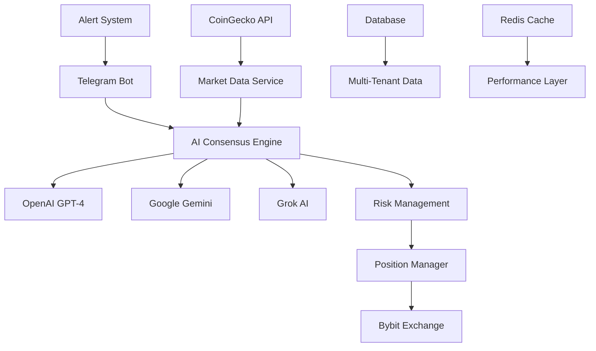

# SentinentX - AI-Powered Cryptocurrency Trading Bot

<div align="center">


[](https://opensource.org/licenses/MIT)
[](https://php.net)
[](https://laravel.com)
[](https://bybit-exchange.github.io/docs/v5/intro)
[](https://www.coingecko.com/en/api)

**Advanced Multi-AI Consensus Trading System with Real-Time Market Analysis**

[Features](#features) • [Installation](#installation) • [Configuration](#configuration) • [Usage](#usage) • [API Documentation](#api-documentation) • [Contributing](#contributing)

</div>

---

## 🚀 Overview

SentinentX is a sophisticated, AI-powered cryptocurrency trading bot that combines multiple AI providers (OpenAI, Google Gemini, Grok) to make consensus-based trading decisions. Built with Laravel 11, it features multi-tenant SaaS architecture, real-time market analysis, and comprehensive risk management.

### 🎯 Key Highlights

- **Multi-AI Consensus**: Combines OpenAI GPT-4, Google Gemini, and Grok for robust decision-making
- **4 Coin Support**: BTC, ETH, SOL, XRP with real-time CoinGecko market data
- **3 Risk Profiles**: Conservative, Moderate, Aggressive with dynamic leverage (3x-75x)
- **Telegram Integration**: Complete trading control via Telegram bot
- **Bybit Integration**: Live trading on Bybit exchange with testnet support
- **SaaS Ready**: Multi-tenant architecture with usage limits and billing
- **Real-Time Monitoring**: Position monitoring with configurable intervals
- **Advanced Security**: HMAC authentication, rate limiting, circuit breakers

---

## 🏗️ Architecture



---

## ✨ Features

### 🤖 AI Trading Engine
- **Multi-Provider Consensus**: 3 AI providers with weighted decision making
- **Confidence-Based Logic**: High confidence (>70%) uses AI SL/TP, low confidence uses risk profile defaults
- **Real-Time Analysis**: Live market data integration with sentiment analysis
- **Anti-Prompt Injection**: Advanced security against AI prompt manipulation

### 💼 Risk Management
- **3 Risk Profiles**:
  - **Conservative**: 3-15x leverage, 20% daily target, 50% equity usage
  - **Moderate**: 15-45x leverage, 50% daily target, 30% equity usage  
  - **Aggressive**: 45-75x leverage, 100-200% daily target, 20% equity usage
- **Dynamic Position Sizing**: Risk-based position calculation
- **Smart Stop Loss**: AI-determined or risk profile-based SL/TP
- **Daily PnL Tracking**: 00:00 to 00:00 profit/loss monitoring

### 📱 Telegram Control
- **Complete Trading Control**: Open, close, monitor positions via Telegram
- **Real-Time Alerts**: Emergency alerts and position updates
- **Command Interface**: Intuitive command system for all operations
- **Status Monitoring**: Live system status and performance metrics

### 🏦 Exchange Integration
- **Bybit API v5**: Full integration with Bybit derivatives trading
- **Order Management**: Market, limit, OCO orders with proper error handling
- **Position Monitoring**: Real-time position tracking and management
- **Testnet Support**: Safe testing environment for strategy development

### 🏢 SaaS Features
- **Multi-Tenant Architecture**: Complete tenant isolation and data security
- **Usage Enforcement**: API rate limits, position limits, plan-based restrictions
- **PostgreSQL Optimized**: Advanced indexing and performance optimization
- **Billing Integration**: Ready for subscription-based monetization

### 🔒 Security & Reliability
- **HMAC Authentication**: Secure API authentication with replay protection
- **Circuit Breakers**: Automatic failure detection and recovery
- **Rate Limiting**: Configurable rate limits per tenant and API
- **Audit Logging**: Comprehensive logging for all trading activities

---

## 🛠️ Installation

### Prerequisites

- **PHP 8.2+** with extensions: BCMath, PDO, Redis, cURL
- **PostgreSQL 13+** (recommended for production)
- **Redis 6+** for caching and session management
- **Composer** for dependency management
- **Node.js 18+** (optional, for frontend assets)

### Quick Start

1. **Clone the repository**
   ```bash
   git clone https://github.com/your-org/sentinentx.git
   cd sentinentx
   ```

2. **Install dependencies**
   ```bash
   composer install --optimize-autoloader --no-dev
   npm install && npm run build
   ```

3. **Environment setup**
   ```bash
   cp env.example.template .env
   php artisan key:generate
   ```

4. **Database setup**
   ```bash
   php artisan migrate --force
   php artisan db:seed --class=TenantSeeder
   ```

5. **Start the application**
   ```bash
   php artisan serve
   php artisan telegram:polling  # In separate terminal
   ```

### Production Installation

Use the automated installation script:

```bash
chmod +x install.sh
sudo ./install.sh
```

The script will:
- Install system dependencies
- Configure PostgreSQL database
- Set up Redis caching
- Configure systemd services
- Set up SSL certificates (optional)
- Configure firewall rules

---

## ⚙️ Configuration

### Environment Variables

Create your `.env` file based on `env.example.template`:

```env
# Application
APP_NAME=SentinentX
APP_ENV=production
APP_KEY=base64:your-app-key-here
APP_DEBUG=false
APP_URL=https://your-domain.com

# Database (PostgreSQL recommended)
DB_CONNECTION=pgsql
DB_HOST=127.0.0.1
DB_PORT=5432
DB_DATABASE=sentinentx
DB_USERNAME=sentinentx_user
DB_PASSWORD=your-secure-password

# Redis Cache
REDIS_HOST=127.0.0.1
REDIS_PASSWORD=your-redis-password
REDIS_PORT=6379

# AI Providers
OPENAI_API_KEY=sk-your-openai-key
OPENAI_MODEL=gpt-4-turbo-preview

GEMINI_API_KEY=your-gemini-key
GEMINI_MODEL=gemini-pro

GROK_API_KEY=your-grok-key
GROK_MODEL=grok-2-1212

# CoinGecko Market Data
COINGECKO_API_KEY=CG-your-coingecko-key

# Bybit Exchange
BYBIT_API_KEY=your-bybit-api-key
BYBIT_API_SECRET=your-bybit-secret
BYBIT_TESTNET=true  # Set to false for live trading

# Telegram Bot
TELEGRAM_BOT_TOKEN=your-telegram-bot-token
TELEGRAM_CHAT_ID=your-telegram-chat-id

# Security
HMAC_SECRET=your-hmac-secret-32-chars
IP_ALLOWLIST="127.0.0.1/32,your-server-ip/32"
```

### Risk Profiles

Configure risk profiles in `config/risk_profiles.php`:

```php
'profiles' => [
    'conservative' => [
        'name' => 'Conservative',
        'leverage' => ['min' => 3, 'max' => 15, 'default' => 10],
        'risk' => [
            'daily_profit_target_pct' => 20.0,
            'per_trade_risk_pct' => 1.0,
            'stop_loss_pct' => 3.0,
            'take_profit_pct' => 6.0,
        ],
        'position_sizing' => [
            'equity_usage_pct' => 50.0,
        ],
        'timing' => [
            'position_check_minutes' => 3.0,
        ],
    ],
    // ... moderate and aggressive profiles
],
```

### Trading Configuration

Set trading parameters in `config/trading.php`:

```php
'symbols' => ['BTCUSDT', 'ETHUSDT', 'SOLUSDT', 'XRPUSDT'],
'position_monitoring' => [
    'new_position_interval_hours' => 2,
    'max_concurrent_positions' => 5,
],
'risk_management' => [
    'max_daily_loss_pct' => 20.0,
    'kill_switch_enabled' => true,
],
```

---

## 🚦 Usage

### Telegram Commands

#### Basic Commands
- `/help` - Show all available commands
- `/status` - System status and health check
- `/scan` - Analyze all 4 coins and get recommendations
- `/balance` - Current account balance
- `/pnl` - Daily profit/loss report

#### Trading Commands
- `/open BTC` - Open Bitcoin position (triggers risk selection)
- `/open ETH` - Open Ethereum position
- `/open SOL` - Open Solana position  
- `/open XRP` - Open XRP position
- `/positions` - View all open positions
- `/close BTC` - Close Bitcoin position

#### Risk Selection
After `/open` command, choose your risk level:
- `/risk1 BTC` - Conservative risk (3-15x leverage)
- `/risk2 BTC` - Moderate risk (15-45x leverage)
- `/risk3 BTC` - Aggressive risk (45-75x leverage)

#### Position Management
- `/manage` - Position management panel
- `/positionmanage` - Advanced position controls

### Trading Workflow

1. **Market Analysis**: Use `/scan` to analyze all 4 coins
2. **Position Opening**: Choose coin with `/open COIN`
3. **Risk Selection**: Select risk profile `/risk1-3 COIN`
4. **AI Analysis**: System performs multi-AI consensus analysis
5. **Execution Confirmation**: Confirm with `/execute COIN`
6. **Monitoring**: Positions monitored automatically based on risk profile
7. **Alerts**: Receive Telegram alerts for position updates

### API Usage

SentinentX provides REST APIs for programmatic access:

```bash
# Get market analysis
curl -X GET "https://your-domain.com/api/v1/analysis/BTCUSDT" \
  -H "Authorization: Bearer your-api-token"

# Open position
curl -X POST "https://your-domain.com/api/v1/positions" \
  -H "Authorization: Bearer your-api-token" \
  -H "Content-Type: application/json" \
  -d '{
    "symbol": "BTCUSDT",
    "risk_profile": "moderate",
    "reason": "API trading test"
  }'
```

---

## 📊 Monitoring & Alerts

### Real-Time Monitoring

- **Position Monitoring**: Automatic monitoring based on risk profile
  - Conservative: Every 3 minutes
  - Moderate: Every 1.5 minutes  
  - Aggressive: Every 1 minute

- **System Health Checks**: Continuous monitoring of:
  - API connectivity (Bybit, CoinGecko, AI providers)
  - Database performance
  - Cache system status
  - Alert delivery status

### Alert Types

- **🚨 Critical Alerts**: System failures, trading errors
- **⚠️ Warning Alerts**: Risk threshold breaches, API rate limits
- **📊 Info Alerts**: Position updates, daily reports
- **🎯 Trading Alerts**: Position opened/closed, profit targets reached

### Performance Metrics

Monitor key metrics via `/status` command or API:
- Daily PnL and target progress
- AI consensus accuracy
- Position win rate
- System uptime and response times

---

## 🧪 Testing

### Running Tests

```bash
# Full test suite
php artisan test

# Specific test suites
php artisan test --testsuite=Unit
php artisan test --testsuite=Feature
php artisan test --testsuite=Integration

# Coverage report
php artisan test --coverage
```

### Test Categories

- **Unit Tests**: Individual service and model testing
- **Feature Tests**: HTTP endpoints and workflow testing
- **Integration Tests**: Multi-service integration testing
- **Property-Based Tests**: Edge case and invariant testing
- **Performance Tests**: Load and stress testing

### Testnet Trading

Enable testnet mode for safe testing:

```env
BYBIT_TESTNET=true
BYBIT_API_KEY=your-testnet-key
BYBIT_API_SECRET=your-testnet-secret
```

---

## 🔧 Development

### Code Quality

We maintain high code quality standards:

- **PSR-12 Compliance**: Automated with Laravel Pint
- **Static Analysis**: PHPStan level 8
- **Type Safety**: Strict typing throughout
- **Documentation**: Comprehensive PHPDoc blocks

### Development Setup

```bash
# Install dev dependencies
composer install

# Run code quality checks
php vendor/bin/pint --test
php vendor/bin/phpstan analyze

# Run development server
php artisan serve --host=0.0.0.0 --port=8000
```

### Architecture Patterns

- **Domain-Driven Design**: Clear separation of business logic
- **CQRS Pattern**: Separate read/write operations for performance
- **Circuit Breaker**: Resilience patterns for external APIs
- **Multi-Tenant**: Tenant-aware data isolation

---

## 🚀 Deployment

### Production Deployment

1. **Server Requirements**
   - Ubuntu 20.04+ / CentOS 8+ / Debian 11+
   - 4+ CPU cores, 8GB+ RAM, 50GB+ SSD
   - PostgreSQL 13+, Redis 6+, PHP 8.2+

2. **Automated Deployment**
   ```bash
   # Use deployment script
   ./deploy.sh production

   # Or manual deployment
   git pull origin main
   composer install --no-dev --optimize-autoloader
   php artisan migrate --force
   php artisan config:cache
   php artisan route:cache
   php artisan view:cache
   ```

3. **Service Configuration**
   ```bash
   # Enable systemd services
   sudo systemctl enable sentinentx-queue
   sudo systemctl enable sentinentx-telegram
   sudo systemctl start sentinentx-queue
   sudo systemctl start sentinentx-telegram
   ```

### Docker Deployment

```bash
# Build and run with Docker Compose
docker-compose up -d

# Or use pre-built image
docker run -d \
  --name sentinentx \
  -p 8000:8000 \
  -e APP_ENV=production \
  sentinentx/app:latest
```

### Monitoring Setup

Configure monitoring with your preferred tools:

- **Application Monitoring**: New Relic, DataDog, or Laravel Telescope
- **Infrastructure Monitoring**: Prometheus + Grafana
- **Log Aggregation**: ELK Stack or Loki
- **Uptime Monitoring**: Pingdom, UptimeRobot

---

## 📚 API Documentation

### Authentication

All API requests require authentication via Bearer token:

```bash
Authorization: Bearer your-api-token
```

### Endpoints

#### Market Analysis
```bash
GET /api/v1/analysis/{symbol}
GET /api/v1/analysis/multi-coin
GET /api/v1/market-data/{symbol}
```

#### Position Management
```bash
GET /api/v1/positions
POST /api/v1/positions
PUT /api/v1/positions/{id}
DELETE /api/v1/positions/{id}
```

#### Risk Management
```bash
GET /api/v1/risk-profiles
GET /api/v1/daily-pnl
GET /api/v1/performance-metrics
```

#### System Status
```bash
GET /api/v1/health
GET /api/v1/status
GET /api/v1/metrics
```

For complete API documentation, visit: `https://your-domain.com/api/documentation`

---

## 🤝 Contributing

We welcome contributions! Please see our [Contributing Guide](CONTRIBUTING.md) for details.

### Development Process

1. **Fork** the repository
2. **Create** a feature branch (`git checkout -b feature/amazing-feature`)
3. **Commit** your changes (`git commit -m 'Add amazing feature'`)
4. **Push** to the branch (`git push origin feature/amazing-feature`)
5. **Open** a Pull Request

### Code Standards

- Follow PSR-12 coding standards
- Write comprehensive tests for new features
- Update documentation for API changes
- Ensure backward compatibility

---

## 📄 License

This project is licensed under the MIT License - see the [LICENSE](LICENSE) file for details.

---

## 🙏 Acknowledgments

- **Laravel Team** - Exceptional PHP framework
- **Bybit** - Reliable cryptocurrency exchange API
- **CoinGecko** - Comprehensive market data
- **OpenAI, Google, Grok** - Advanced AI capabilities
- **Community Contributors** - Valuable feedback and improvements

---

## 📞 Support

- **Documentation**: [Wiki](https://github.com/your-org/sentinentx/wiki)
- **Issues**: [GitHub Issues](https://github.com/your-org/sentinentx/issues)
- **Discussions**: [GitHub Discussions](https://github.com/your-org/sentinentx/discussions)
- **Email**: support@sentinentx.com

---

<div align="center">

**⭐ Star this repository if you find it helpful!**

Made with ❤️ for the crypto trading community

</div>