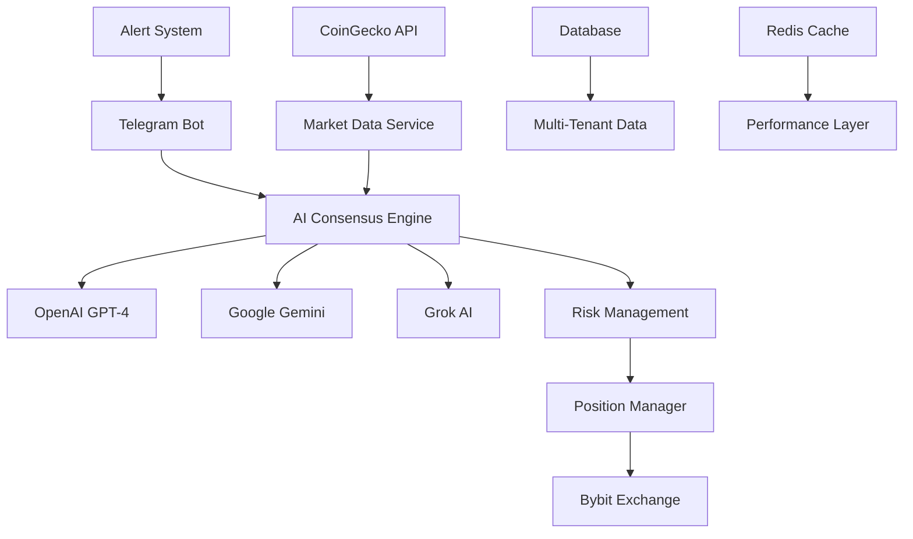

# 🚀 SentinentX - AI-Powered Cryptocurrency Trading Bot

**Enterprise-grade AI trading system with multi-provider consensus for automated cryptocurrency trading on Bybit Exchange.**

[](https://opensource.org/licenses/MIT)
[](https://php.net)
[](https://laravel.com)
[](https://postgresql.org)

---

## 🎯 **Overview**

SentinentX is a sophisticated trading bot that leverages **3 AI providers** (OpenAI GPT-4, Google Gemini, Grok) to make consensus-based trading decisions. Built for **professional traders**, **trading firms**, and **crypto hedge funds** who demand reliability, transparency, and performance.

### ✨ **Key Features**

🤖 **Multi-AI Consensus Engine**
- OpenAI GPT-4o-mini, Google Gemini 2.0, Grok AI
- 2-stage consensus with confidence scoring
- Deviation veto and reliability checks
- Fallback strategies and circuit breakers

💼 **Advanced Risk Management**
- 3 Risk Profiles: Conservative, Moderate, Aggressive
- Dynamic leverage: 3-75x based on confidence
- Daily profit targets: 20%, 50%, 100-200%
- Smart position sizing and correlation checks

🏦 **Bybit Exchange Integration**
- Full API v5 integration (testnet/mainnet)
- Real-time order execution and management
- OCO orders, stop-loss, take-profit
- Position monitoring and PnL tracking

📱 **Telegram Control Interface**
- Complete trading control via Telegram
- Real-time alerts and notifications
- Command-based position management
- Emergency alerts and system status

📊 **Comprehensive Analytics**
- Multi-coin analysis (BTC, ETH, SOL, XRP)
- CoinGecko market data integration
- Comprehensive logging for backtesting
- Performance metrics and LAB system

🏢 **Enterprise SaaS Features**
- Multi-tenant architecture
- Subscription-based billing
- API rate limiting and usage tracking
- HMAC authentication and security

---

## 🏗️ **Architecture**



---

## 📋 **System Requirements**

### **Minimum Requirements:**
- **OS**: Ubuntu 22.04/24.04 LTS x64
- **RAM**: 2GB minimum, 4GB recommended
- **Storage**: 10GB available space
- **CPU**: 2 cores minimum

### **Software Dependencies:**
- **PHP**: 8.3+ with extensions (automatically installed)
- **Database**: PostgreSQL 14+
- **Cache**: Redis 6+
- **Web Server**: Nginx
- **Process Manager**: Systemd

---

## ⚡ **Quick Start - VDS Deployment**

### **1. Download Deployment Template**
```bash
curl -sSL 'https://raw.githubusercontent.com/emiryucelweb/SentinentX/main/ultimate_vds_deployment_template.sh' > deploy.sh
```

### **2. Configure API Keys**
Edit `deploy.sh` and replace the following placeholders:

```bash
# Required API Keys
COINGECKO_API_KEY="your_coingecko_api_key"
BYBIT_API_KEY="your_bybit_api_key"
BYBIT_API_SECRET="your_bybit_api_secret"
OPENAI_API_KEY="your_openai_api_key"
GROK_API_KEY="your_grok_api_key"
GEMINI_API_KEY="your_gemini_api_key"
TELEGRAM_BOT_TOKEN="your_telegram_bot_token"
TELEGRAM_CHAT_ID="your_telegram_chat_id"
```

### **3. Run Deployment**
```bash
chmod +x deploy.sh && ./deploy.sh
```

**🎉 That's it! Your system will be ready for 15-day testnet trading.**

---

## 🐧 **Ubuntu 24.04 LTS Deployment (Recommended)**

### **🚀 Automated Installation**

For **production deployments** on Ubuntu 24.04 LTS with enterprise-grade configuration:

```bash
# Download the Ubuntu 24.04 LTS installer
curl -fsSL https://raw.githubusercontent.com/sentinentx/sentinentx/main/deploy/ubuntu24/install.sh -o install.sh

# Review the script (recommended)
cat install.sh

# Run installation
chmod +x install.sh
sudo ./install.sh
```

### **📦 What Gets Installed**

| Component | Version | Purpose |
|-----------|---------|---------|
| **PHP** | 8.3+ | Application runtime with OPcache |
| **PostgreSQL** | 16+ | Primary database with performance tuning |
| **Redis** | 7+ | Cache & queue management |
| **Nginx** | Latest | Web server with security headers |
| **Node.js** | 20+ | Frontend asset compilation |
| **systemd** | Native | Service management & monitoring |

### **⚙️ systemd Services**

After installation, manage SentinentX with these services:

```bash
# Main application service
sudo systemctl start sentinentx
sudo systemctl status sentinentx

# Individual service management
sudo systemctl start sentinentx-queue      # Queue worker
sudo systemctl start sentinentx-scheduler  # Task scheduler  
sudo systemctl start sentinentx-ws         # WebSocket server

# View service logs
sudo journalctl -f -u sentinentx
sudo journalctl -f -u sentinentx-queue
```

### **🔧 Configuration**

1. **Configure environment file:**
```bash
sudo nano /var/www/sentinentx/.env
```

2. **Essential settings to update:**
```env
# AI Provider Keys
OPENAI_API_KEY=sk-your-openai-key
GEMINI_API_KEY=your-gemini-key  
GROK_API_KEY=your-grok-key

# Trading Configuration
BYBIT_API_KEY=your-bybit-key
BYBIT_API_SECRET=your-bybit-secret
BYBIT_TESTNET=true

# Telegram Notifications
TELEGRAM_BOT_TOKEN=your-bot-token
TELEGRAM_CHAT_ID=your-chat-id

# Allowed Trading Pairs
ALLOWED_SYMBOLS=BTCUSDT,ETHUSDT,SOLUSDT,XRPUSDT
```

3. **Start the services:**
```bash
sudo systemctl enable --now sentinentx
sudo systemctl enable --now sentinentx-scheduler
sudo systemctl enable --now sentinentx-queue
sudo systemctl enable --now sentinentx-ws
```

### **📊 Health Monitoring**

```bash
# Comprehensive health check
cd /var/www/sentinentx
php artisan sentx:health-check

# Service status overview
sudo systemctl status sentinentx*

# Resource monitoring
htop
df -h
free -h
```

### **🔒 Security Features**

The Ubuntu 24.04 deployment includes:
- ✅ **systemd security hardening** (NoNewPrivileges, PrivateTmp, etc.)
- ✅ **UFW firewall** configuration
- ✅ **fail2ban** intrusion prevention
- ✅ **Resource limits** (memory, CPU, file descriptors)
- ✅ **Service isolation** and sandboxing
- ✅ **Automatic restart** on failure

### **📋 Quick Verification**

```bash
# Test web interface
curl http://localhost/api/health

# Test database connection
sudo -u www-data php /var/www/sentinentx/artisan migrate:status

# Test Redis
redis-cli ping

# View application logs
tail -f /var/www/sentinentx/storage/logs/laravel.log
```

### **📖 Detailed Documentation**

For comprehensive deployment instructions, troubleshooting, and maintenance:
- 📖 **[Ubuntu 24.04 Deployment Guide](deploy/ubuntu24/DEPLOYMENT_GUIDE.md)**
- 🔧 **[Service Configuration](deploy/ubuntu24/)**
- 🚨 **[Emergency Procedures](RUNBOOK.md)**

---

## 🎮 **Post-Deployment Control**

### **Service Management**
```bash
# Check status
systemctl status sentinentx

# View live logs
journalctl -fu sentinentx

# Restart service
systemctl restart sentinentx

# Stop service
systemctl stop sentinentx
```

### **Trading Commands**
```bash
# Open new position with AI analysis
php artisan sentx:open-now --dry

# Manage existing positions
php artisan sentx:manage-positions

# Risk analysis
php artisan sentx:risk-analysis

# Multi-coin analysis
php artisan sentx:open-specific BTC --dry
```

### **Telegram Commands**
- `/status` - System status
- `/balance` - Account balance
- `/positions` - Open positions
- `/scan` - Market scan
- `/help` - All commands

---

## 💡 **Risk Profiles**

### **Conservative Profile**
- **Leverage**: 3-15x
- **Daily Target**: 20%
- **Equity Usage**: 50%
- **Monitoring**: Every 3 minutes
- **Ideal for**: Stable, low-risk trading

### **Moderate Profile** 
- **Leverage**: 15-45x
- **Daily Target**: 50%
- **Equity Usage**: 30%
- **Monitoring**: Every 1.5 minutes
- **Ideal for**: Balanced risk/reward

### **Aggressive Profile**
- **Leverage**: 45-75x
- **Daily Target**: 100-200%
- **Equity Usage**: 20%
- **Monitoring**: Every 1 minute
- **Ideal for**: High-risk, high-reward

---

## 🔧 **Configuration**

### **Environment Variables**
```bash
# Trading Configuration
RISK_PROFILE=moderate                    # conservative|moderate|aggressive
BYBIT_TESTNET=true                      # Use testnet for testing
TRADING_MAX_LEVERAGE=75                 # Maximum leverage allowed
TRADING_KILL_SWITCH=false               # Emergency stop

# AI Configuration
OPENAI_ENABLED=true
GEMINI_ENABLED=true
GROK_ENABLED=true

# Logging Configuration
ENABLE_COMPREHENSIVE_LOGS=true
AI_DECISION_LOGGING=true
POSITION_LOGGING=true
PNL_DETAILED_LOGGING=true
```

### **Supported Trading Pairs**
- **BTCUSDT** - Bitcoin/USDT
- **ETHUSDT** - Ethereum/USDT  
- **SOLUSDT** - Solana/USDT
- **XRPUSDT** - XRP/USDT

---

## 📊 **Monitoring & Logging**

### **Log Files**
```bash
# Application logs
tail -f /var/www/sentinentx/storage/logs/laravel.log

# System service logs
journalctl -fu sentinentx

# Nginx access logs
tail -f /var/log/nginx/sentinentx_access.log

# Nginx error logs
tail -f /var/log/nginx/sentinentx_error.log
```

### **Performance Metrics**
- Real-time PnL tracking
- Daily profit/loss summaries
- AI decision accuracy
- Risk metric monitoring
- Position success rates

---

## 🛡️ **Security Features**

### **Authentication & Authorization**
- HMAC-based API authentication
- IP allowlisting
- Rate limiting per user/tenant
- Secure session management

### **Data Protection**
- Encrypted API keys storage
- Multi-tenant data isolation
- Audit logs for all actions
- GDPR compliance features

### **Trading Security**
- Position size limits
- Daily loss limits
- Correlation checks
- Liquidation protection
- Emergency stop mechanisms

---

## 🔄 **15-Day Testnet Process**

### **Automated Cycle**
1. **Every 2 hours**: New position analysis
2. **Every 1-3 minutes**: Position monitoring (based on risk profile)
3. **Continuous**: Market data collection
4. **Real-time**: Risk monitoring and alerts

### **AI Decision Process**
1. **Market Data Collection**: CoinGecko + Bybit APIs
2. **Multi-Coin Analysis**: All 4 supported coins
3. **AI Consensus**: 3 providers analyze data
4. **Best Coin Selection**: Highest reliability score
5. **Position Execution**: Smart position sizing
6. **Continuous Monitoring**: AI-based management

---

## 🔌 **API Integration**

### **Required API Keys**
| Service | Purpose | Free Tier | Paid Tier |
|---------|---------|-----------|-----------|
| **CoinGecko** | Market data & sentiment | 30 calls/min | 500+ calls/min |
| **Bybit** | Trading execution | Testnet unlimited | Mainnet trading |
| **OpenAI** | AI decision making | $5 free credit | Pay per use |
| **Google AI** | AI consensus | Free tier available | Enhanced limits |
| **Grok (X.AI)** | AI analysis | Limited free | Monthly plans |
| **Telegram** | Bot interface | Free | Free |

### **API Acquisition Guide**
1. **CoinGecko**: [API Portal](https://www.coingecko.com/en/api)
2. **Bybit**: [Developer Portal](https://www.bybit.com/app/user/api-management)
3. **OpenAI**: [API Keys](https://platform.openai.com/api-keys)
4. **Google AI**: [AI Studio](https://aistudio.google.com/app/apikey)
5. **Grok**: [X.AI Console](https://console.x.ai/)
6. **Telegram**: [BotFather](https://t.me/botfather)

---

## 📈 **Performance & Optimization**

### **System Performance**
- **Response Time**: < 500ms average
- **Uptime**: 99.9% target
- **Memory Usage**: < 512MB typical
- **CPU Usage**: < 20% typical

### **Trading Performance**
- **Decision Latency**: < 2 seconds
- **Order Execution**: < 100ms
- **Position Monitoring**: Real-time
- **Data Freshness**: < 30 seconds

---

## 🛠️ **Development & Contribution**

### **Local Development Setup**
```bash
# Clone repository
git clone https://github.com/emiryucelweb/SentinentX.git
cd SentinentX

# Install dependencies
composer install
npm install

# Setup environment
cp .env.example .env
php artisan key:generate

# Run migrations
php artisan migrate

# Start development server
php artisan serve
```

### **Testing**
```bash
# Run all tests
php artisan test

# Run specific test suites
php artisan test --filter=Unit
php artisan test --filter=Feature
php artisan test --filter=Integration
```

---

## 📞 **Support & Documentation**

### **Documentation**
- [Trading Strategies Guide](docs/TRADING_STRATEGIES.md)
- [API Reference](docs/API_REFERENCE.md)
- [Deployment Guide](docs/DEPLOYMENT_GUIDE.md)
- [Troubleshooting](docs/TROUBLESHOOTING.md)

### **Community**
- **Issues**: [GitHub Issues](https://github.com/emiryucelweb/SentinentX/issues)
- **Discussions**: [GitHub Discussions](https://github.com/emiryucelweb/SentinentX/discussions)
- **Telegram**: [@SentinentXSupport](https://t.me/SentinentXSupport)

---

## ⚖️ **Legal & Compliance**

### **Disclaimer**
- This software is for educational and research purposes
- Trading cryptocurrencies involves significant risk
- Past performance does not guarantee future results
- Users are responsible for their own trading decisions
- Always test thoroughly in testnet before mainnet

### **License**
This project is licensed under the MIT License - see the [LICENSE](LICENSE) file for details.

---

## 🚀 **Get Started Today**

Ready to revolutionize your crypto trading with AI?

1. **Deploy** using our one-command script
2. **Configure** your risk profile
3. **Start** your 15-day testnet
4. **Monitor** performance and optimize
5. **Scale** to mainnet when ready

**Let SentinentX's AI consensus guide your trading success!**

---

*Built with ❤️ by the SentinentX Team*