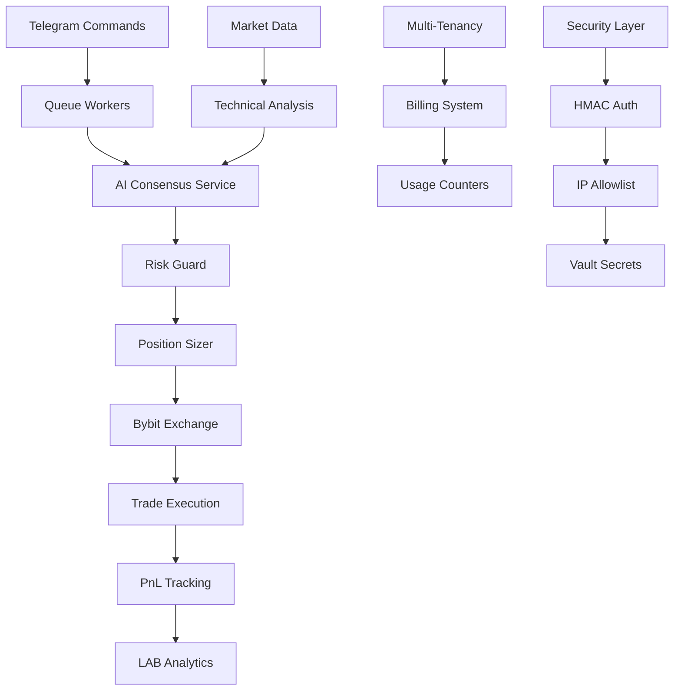

# 📁 SentinentX Repository Map & Architecture

**Generated:** 2025-01-20 | **Project:** SentinentX v1.0 | **Stack:** Laravel 12.x + PHP 8.2+ + PostgreSQL/Redis

## 🏗️ Overall Architecture

SentinentX is a **SaaS-ready AI-powered cryptocurrency trading bot** built with Laravel 12.x, featuring:
- **Multi-AI consensus system** (OpenAI, Gemini, Grok)
- **Multi-tenant SaaS architecture** with plan-based billing
- **Bybit Exchange integration** (testnet/mainnet)
- **Advanced risk management** and position sizing
- **LAB backtesting system** for strategy validation
- **Comprehensive observability** and security features

## 📊 System Flow Diagram



## 🗂️ Directory Structure & Roles

### `/app/` - Application Core
```
├── Console/Commands/          # 34 Artisan commands (trading, AI, LAB, admin)
│   ├── OpenNowCommand.php     # Primary trading entry point
│   ├── ManageOpenCommand.php  # Position management (5-min cron)
│   ├── TelegramPollingCommand.php # Bot interface
│   └── Lab*.php              # Backtesting commands
├── Contracts/                 # 8 interfaces for DI
│   ├── AiProvider.php         # AI service abstraction
│   ├── RiskGuardInterface.php # Risk management interface
│   └── Lab/                   # LAB system interfaces
├── Domain/                    # 1 core domain service
├── DTO/                       # 2 data transfer objects
├── Exceptions/                # 1 custom exception handler
├── Http/                      # 19 controllers & middleware
│   ├── Controllers/           # API & admin endpoints
│   ├── Middleware/            # Security, tenant context, HMAC
│   └── Requests/              # Form validation
├── Jobs/                      # 1 background job processor
├── Models/                    # 16 Eloquent models (multi-tenant)
│   ├── User.php              # Multi-tenant users
│   ├── Tenant.php            # SaaS tenant isolation
│   ├── Trade.php             # Trading records
│   ├── Subscription.php      # Billing plans
│   └── Lab*.php              # Backtesting models
├── Providers/                 # 7 service providers
├── Security/                  # 4 security components
│   ├── Hmac/                 # HMAC authentication
│   └── Allowlist/            # IP allowlisting
└── Services/                  # 78 business logic services
    ├── AI/                   # Multi-AI consensus (OpenAI, Gemini, Grok)
    ├── Exchange/             # Bybit API integration
    ├── Trading/              # Position management, risk
    ├── Risk/                 # Risk guards, correlation
    ├── Lab/                  # Backtesting engine
    ├── Notifier/             # Telegram, Slack alerts
    └── Security/             # Vault, encryption
```

### `/config/` - Configuration Files
```
├── ai.php                    # AI consensus & rate limits
├── trading.php               # Risk, leverage, symbols
├── exchange.php              # Bybit API endpoints
├── security.php              # HMAC, IP allowlist
├── billing.php               # SaaS plans & features
├── lab.php                   # Backtesting configuration
├── health.php                # Health check settings
├── vault.php                 # HashiCorp Vault integration
└── database_saas.php         # Multi-tenant DB config
```

### `/database/` - Database Layer
```
├── migrations/               # 30 migration files
│   ├── create_tenants_table.php      # Multi-tenancy
│   ├── create_subscriptions_table.php # Billing
│   ├── create_trades_table.php       # Trading records
│   └── create_lab_*.php              # Backtesting
├── seeders/                  # 2 data seeders
└── factories/                # 3 model factories
```

### `/tests/` - Test Suite
```
├── Feature/                  # 100+ integration tests
│   ├── Trading/              # Trading system tests
│   ├── AI/                   # AI consensus tests
│   ├── Risk/                 # Risk management tests
│   └── Lab/                  # Backtesting tests
└── Unit/                     # 33+ unit tests
```

### Entry Points & Runtime Components

#### 🔄 **Scheduled Jobs (Cron)**
- **`sentx:open-now`** - Main trading scanner (*/5 min)
- **`sentx:manage-open`** - Position management (*/5 min) 
- **`sentx:lab-run`** - Backtesting execution (daily)
- **`sentx:health-check`** - System monitoring (*/5 min)

#### 🌐 **HTTP Endpoints**
- **`/admin/*`** - Admin API (HMAC protected)
- **`/api/*`** - Public API (rate limited)
- **`/webhook/telegram`** - Telegram webhook
- **`/health`** - Health check endpoint

#### 📱 **Telegram Commands**
- `/open SYMBOL` - AI-powered position opening
- `/manage` - Position management
- `/status` - System health
- `/balance` - Account information
- `/positions` - Active positions

#### ⚙️ **Queue Workers**
- `queue:work` - Async job processing
- `telegram:polling` - Bot message handling
- `schedule:work` - Cron scheduler

## 🔐 Security Architecture

### Multi-Layer Security
1. **HMAC Authentication** - Request signing for admin API
2. **IP Allowlisting** - Network-level access control
3. **Tenant Isolation** - Database row-level security
4. **Vault Integration** - External secret management
5. **Rate Limiting** - API abuse protection
6. **Security Headers** - XSS, CSRF, CSP protection

### Secret Management
- **Development:** `.env` files (example provided)
- **Production:** HashiCorp Vault integration
- **CI/CD:** Kubernetes secrets

## 🏦 Multi-Tenant SaaS Features

### Tenant Isolation
- **Row-level security** with `tenant_id` foreign keys
- **Plan-based feature gating** (Free, Starter, Pro, Enterprise)
- **Usage tracking & billing** integration
- **Per-tenant configuration** overrides

### Billing Plans
- **Free Tier:** 100 AI requests, 50 trades/month
- **Starter ($29):** 1K AI requests, 500 trades/month  
- **Professional ($99):** 5K AI requests, 2K trades/month
- **Enterprise ($299):** Unlimited usage

## 📈 Data Flow & Processing

### AI Consensus Pipeline
```
Market Data → Technical Analysis → AI Prompt → 3-AI Consensus → Risk Validation → Position Sizing → Order Execution
```

### Risk Management Flow
```
Position Request → Daily Loss Check → Correlation Analysis → Leverage Validation → ATR-based SL/TP → Execution
```

### LAB Backtesting Flow
```
Historical Data → Synthetic Price Path → Strategy Simulation → Performance Metrics → Acceptance Criteria
```

## 🚀 Deployment Architecture

### Development Stack
- **Web Server:** Laravel's built-in server (port 8000)
- **Queue:** Redis-backed job processing
- **Database:** PostgreSQL 15+ / SQLite for testing
- **Cache:** Redis 7+
- **Monitoring:** Laravel Telescope + custom metrics

### Production Stack (VDS/K8s)
- **Web Server:** Nginx + PHP-FPM
- **Queue:** Supervisor-managed workers
- **Database:** PostgreSQL with connection pooling
- **Cache:** Redis Cluster
- **Secrets:** HashiCorp Vault
- **Monitoring:** Prometheus + Grafana
- **Log Aggregation:** ELK Stack

## 📊 Performance Characteristics

### Target Metrics
- **AI Response Time:** <3s average
- **Order Execution:** <500ms
- **System Throughput:** 100+ req/min
- **Queue Processing:** <1s per job

### Optimization Features
- **Redis caching** for market data & AI responses
- **Database indexing** for time-series queries
- **Connection pooling** for external APIs
- **Async job processing** for non-blocking operations

## 🔍 Key Integration Points

### External Services
- **Bybit API:** Trading execution (testnet/mainnet)
- **OpenAI API:** GPT-4 consensus
- **Google Gemini:** Gemini-2.0-flash consensus  
- **Grok API:** Grok-2 consensus
- **CoinGecko:** Market data supplementation
- **Telegram Bot API:** User interface
- **HashiCorp Vault:** Secret management

### Internal Interfaces
- **AI Consensus Service:** Multi-provider abstraction
- **Risk Guard:** Unified risk validation
- **Position Sizer:** Dynamic leverage calculation
- **Trade Manager:** Order lifecycle management
- **LAB Engine:** Backtesting simulation

---

**Key Architectural Decisions:**
- Laravel 12.x for rapid development & ecosystem
- Multi-tenant SaaS from day one
- External AI APIs for consensus (no local models)
- PostgreSQL for ACID compliance & complex queries
- Redis for caching & job queues
- HashiCorp Vault for production secret management
- Kubernetes-ready containerization
