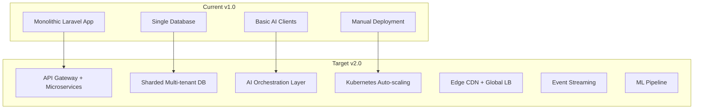

# 🗺️ SentinentX SaaS Refactor & Enhancement Roadmap

**Version:** v1.0 → v2.0 (SaaS-Production Ready)  
**Timeline:** 3 months (Q1 2025)  
**Goal:** Transform from prototype to enterprise-grade SaaS platform

## 🎯 Strategic Objectives

### 🏦 **SaaS Foundation**
- **Multi-tenant isolation** with guaranteed data security
- **Subscription management** with automated billing
- **Self-service onboarding** for rapid customer acquisition
- **Usage analytics** for product optimization

### 🛡️ **Enterprise Security**
- **Zero-trust architecture** with comprehensive audit trails
- **SOC 2 Type II compliance** preparation
- **Advanced threat protection** and monitoring
- **Secrets management** with rotation automation

### ⚡ **Performance & Scale**
- **1000+ RPS capability** with horizontal scaling
- **Sub-100ms API responses** for real-time trading
- **99.9% uptime SLA** with automated failover
- **Global edge deployment** for latency optimization

### 🔬 **AI/ML Enhancement**
- **Advanced consensus algorithms** with confidence scoring
- **Market sentiment integration** for enhanced decisions
- **Real-time model performance** tracking and adaptation
- **Custom model training** for enterprise customers

## 📅 Three-Phase Delivery Plan

## Phase 1: Foundation & Security (Month 1)

### 🚨 **Critical Security Hardening**
**Epic 1.1: Secrets & Authentication Overhaul**
- [ ] **Remove hard-coded secrets** from all install scripts
- [ ] **Create comprehensive .env.example** with security warnings
- [ ] **Implement HashiCorp Vault** production integration
- [ ] **Add secret rotation** automation and monitoring
- [ ] **Deploy security scanning** in CI/CD pipeline

**Epic 1.2: Advanced Authentication & Authorization**
- [ ] **Reduce HMAC replay window** to 60 seconds with jitter
- [ ] **Implement JWT-based API authentication** for customers
- [ ] **Add OAuth2/OIDC integration** for enterprise SSO
- [ ] **Deploy role-based access control (RBAC)** system
- [ ] **Create audit logging** for all security events

**Epic 1.3: Network & Application Security**
- [ ] **Implement WAF rules** for API protection
- [ ] **Add DDoS protection** with rate limiting
- [ ] **Deploy security headers** with strict CSP
- [ ] **Implement IP geolocation** blocking for compliance
- [ ] **Add vulnerability scanning** automation

### 💾 **Data Architecture & Reliability**
**Epic 1.4: Database Optimization & Safety**
- [ ] **Add query timeouts** and connection pooling
- [ ] **Implement database replication** for high availability
- [ ] **Create automated backup** strategy with point-in-time recovery
- [ ] **Add database migration** safety checks and rollbacks
- [ ] **Optimize indexes** and eliminate N+1 queries

**Epic 1.5: Circuit Breakers & Resilience**
- [ ] **Implement circuit breakers** for all external APIs
- [ ] **Add exponential backoff** with jitter for retries
- [ ] **Create graceful degradation** for AI service failures
- [ ] **Deploy health check endpoints** with detailed status
- [ ] **Add chaos engineering** testing framework

**Deliverables:**
- ✅ Security-hardened core platform
- ✅ 99.5% uptime capability
- ✅ SOC 2 compliance foundation
- ✅ Automated security monitoring

## Phase 2: SaaS Platform Features (Month 2)

### 🏢 **Multi-Tenant Architecture**
**Epic 2.1: Complete Tenant Isolation**
- [ ] **Audit all database queries** for tenant scoping
- [ ] **Implement row-level security** in PostgreSQL
- [ ] **Add tenant-aware middleware** for all endpoints
- [ ] **Create tenant configuration** management system
- [ ] **Deploy tenant monitoring** and alerting

**Epic 2.2: Subscription & Billing Engine**
- [ ] **Integrate Stripe payment processing** with webhooks
- [ ] **Implement usage metering** and billing automation
- [ ] **Create self-service billing** portal for customers
- [ ] **Add subscription lifecycle** management (trials, upgrades, cancellations)
- [ ] **Deploy revenue analytics** and churn prediction

**Epic 2.3: Customer Onboarding & Self-Service**
- [ ] **Create signup flow** with email verification
- [ ] **Build onboarding wizard** with API key setup
- [ ] **Implement customer dashboard** with usage analytics
- [ ] **Add documentation portal** with interactive tutorials
- [ ] **Deploy customer support** ticketing system

### 📊 **Advanced Analytics & Monitoring**
**Epic 2.4: Observability Suite**
- [ ] **Deploy Prometheus metrics** collection
- [ ] **Create Grafana dashboards** for operations and customers
- [ ] **Implement distributed tracing** with Jaeger
- [ ] **Add custom business metrics** for trading performance
- [ ] **Deploy alerting rules** for proactive monitoring

**Epic 2.5: Customer Success Platform**
- [ ] **Build usage analytics** for customer insights
- [ ] **Create performance benchmarks** and reports
- [ ] **Implement feature usage** tracking and recommendations
- [ ] **Add customer health** scoring and intervention
- [ ] **Deploy automated customer** communications

**Deliverables:**
- ✅ Fully isolated multi-tenant platform
- ✅ Automated billing and subscription management
- ✅ Self-service customer portal
- ✅ Comprehensive observability stack

## Phase 3: Scale & Intelligence (Month 3)

### ⚡ **Performance & Scalability**
**Epic 3.1: Horizontal Scaling Architecture**
- [ ] **Implement microservices** for AI consensus
- [ ] **Deploy load balancing** with auto-scaling
- [ ] **Add database sharding** for large customers
- [ ] **Create edge caching** for global latency
- [ ] **Implement queue partitioning** for parallel processing

**Epic 3.2: Market Data & Real-time Systems**
- [ ] **Upgrade to WebSocket** market data feeds
- [ ] **Implement event streaming** with Apache Kafka
- [ ] **Add real-time position** monitoring and alerts
- [ ] **Create market data** normalization and validation
- [ ] **Deploy latency optimization** for order execution

### 🤖 **AI/ML Enhancement Suite**
**Epic 3.3: Advanced AI Consensus**
- [ ] **Implement confidence scoring** for AI decisions
- [ ] **Add market sentiment** integration (news, social)
- [ ] **Create model performance** tracking and drift detection
- [ ] **Deploy A/B testing** for AI strategies
- [ ] **Add custom model** training for enterprise

**Epic 3.4: Risk Management 2.0**
- [ ] **Implement portfolio-level** risk management
- [ ] **Add correlation analysis** across positions
- [ ] **Create dynamic risk** adjustment based on market conditions
- [ ] **Deploy stress testing** and scenario analysis
- [ ] **Add regulatory compliance** reporting

### 🌍 **Enterprise Features**
**Epic 3.5: Enterprise Integration & Customization**
- [ ] **Create white-label** platform for partners
- [ ] **Implement custom strategy** builder interface
- [ ] **Add multi-exchange** support (Binance, OKX, Coinbase)
- [ ] **Deploy webhook system** for external integrations
- [ ] **Create enterprise admin** console with delegation

**Epic 3.6: Global Deployment & Compliance**
- [ ] **Deploy multi-region** infrastructure
- [ ] **Implement GDPR compliance** features (data portability, deletion)
- [ ] **Add KYC/AML integration** for regulated markets
- [ ] **Create compliance reporting** automation
- [ ] **Deploy disaster recovery** procedures

**Deliverables:**
- ✅ Enterprise-grade scalable platform
- ✅ Advanced AI capabilities with market intelligence
- ✅ Global compliance and deployment
- ✅ White-label partner program

## 🏗️ Technical Architecture Evolution

### Current → Target Architecture



### New Service Architecture
```
├── api-gateway/              # Kong/Envoy for routing & auth
├── tenant-service/           # Multi-tenant management
├── billing-service/          # Stripe integration & usage
├── ai-orchestrator/          # AI consensus coordination
├── market-data-service/      # Real-time data normalization
├── risk-engine/              # Portfolio risk management
├── notification-service/     # Multi-channel alerts
├── analytics-service/        # Customer & business analytics
└── admin-console/           # Internal operations portal
```

## 📊 Success Metrics & KPIs

### Technical Excellence
| Metric | Current | Target | Timeline |
|--------|---------|--------|----------|
| **API Response Time** | 200-500ms | <100ms | Month 2 |
| **System Uptime** | 95% | 99.9% | Month 1 |
| **Test Coverage** | 68% | >90% | Month 2 |
| **Security Score** | 6/10 | 9/10 | Month 1 |
| **Customer Onboarding** | Manual | <5 min | Month 2 |

### Business Impact
| Metric | Target | Timeline |
|--------|--------|----------|
| **Monthly Recurring Revenue** | $50K+ | Month 3 |
| **Customer Acquisition Cost** | <$200 | Month 2 |
| **Customer Churn Rate** | <5%/month | Month 3 |
| **Net Promoter Score** | >70 | Month 3 |
| **Support Ticket Ratio** | <2% users | Month 2 |

## 🛠️ Development & Deployment Strategy

### Migration Approach
1. **Blue-Green Deployment** for zero-downtime migrations
2. **Feature Flags** for gradual rollout of new capabilities
3. **Database Migrations** with automated rollback procedures
4. **API Versioning** for backward compatibility
5. **Canary Releases** for risk mitigation

### Quality Gates
- [ ] **Security Scan** passes for all PRs
- [ ] **Performance Benchmarks** meet targets
- [ ] **Integration Tests** cover all APIs
- [ ] **Load Testing** validates scale requirements
- [ ] **Customer UAT** approval for major features

### DevOps Pipeline
```yaml
# .github/workflows/production.yml
stages:
  - security_scan     # SAST, DAST, secrets
  - unit_tests       # >90% coverage required
  - integration_tests # API & service tests
  - performance_tests # Load & stress testing
  - staging_deploy   # Full environment validation
  - security_approval # Manual security review
  - production_deploy # Blue-green deployment
  - post_deploy_tests # Smoke tests & monitoring
```

## 💰 Investment & Resource Requirements

### Development Team (3 months)
- **2x Senior Full-stack Developers** (Laravel, React)
- **1x DevOps Engineer** (Kubernetes, AWS/GCP)
- **1x Security Engineer** (Penetration testing, compliance)
- **1x Data Engineer** (Analytics, ML pipeline)
- **0.5x Product Manager** (Requirements, customer feedback)

### Infrastructure Costs
- **Development Environment:** $2K/month
- **Staging Environment:** $5K/month  
- **Production Environment:** $15K/month (scaling to $50K+)
- **Third-party Services:** $3K/month (Stripe, monitoring, security)

### Total Investment
- **Development:** $120K (3 months × $40K/month team cost)
- **Infrastructure:** $25K (3 months setup + ongoing)
- **Tools & Licenses:** $10K (security tools, monitoring, CI/CD)
- **Total:** $155K for complete transformation

## 🔮 Future Roadmap (Months 4-6)

### Advanced Features
- **AI Model Marketplace** for custom trading strategies
- **Social Trading** features with copy trading
- **Mobile Application** for iOS and Android
- **Institutional Features** (prime brokerage, reporting)
- **DeFi Integration** (DEX trading, yield farming)

### Geographic Expansion
- **EU Compliance** (MiFID II, GDPR)
- **APAC Markets** (Japan, Singapore regulations)
- **US Expansion** (SEC compliance, state regulations)

---

**🎯 Success Definition:** SentinentX becomes the leading AI-powered trading platform with:
- 1000+ paying customers
- $1M+ ARR (Annual Recurring Revenue)
- 99.9% uptime SLA
- SOC 2 Type II certification
- Industry-leading AI consensus accuracy

**📞 Stakeholder Communication:**
- Weekly sprint reviews with technical demos
- Monthly business reviews with metrics dashboard
- Quarterly board presentations with growth projections
